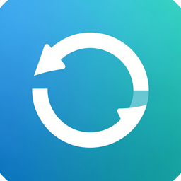

<p align="center">
  
</p>

<h1 align="center">Synchro</h1>

<p align="center">
  A native macOS file synchronization utility built with SwiftUI.
</p>

---

## Modes

**Bidirectional** (default) — copies newer and missing files in both directions. Both locations end up with the union of all files. Never deletes. Newer files win on conflicts.

**Mirror** — makes target an exact copy of source. Files in target not present in source are deleted. Destructive — requires confirmation.

## Features

- Drag & drop folder selection
- Dry run preview before committing changes
- Checksum-based comparison for unreliable timestamps
- Live rsync log output
- Cancellation mid-sync
- Remembers folders across launches via security-scoped bookmarks

## Options

| Option | Description |
|--------|-------------|
| Dry Run | Preview what would change without writing anything |
| Checksum | Compare files by content instead of size/mtime (slower, more reliable) |

## Build

Requires macOS 14+ and Xcode 16+.

```bash
brew install xcodegen  # if not installed
xcodegen generate
open Synchro.xcodeproj
```

Or build from the command line:

```bash
xcodegen generate
xcodebuild -scheme Synchro build
```

## CLI

A standalone bash script is also included for terminal usage:

```bash
# Bidirectional sync
./synchro ~/Projects /Volumes/Backup/Projects

# Mirror mode
./synchro --mirror ~/Source ~/Target

# Dry run with checksum
./synchro -d -c ~/Projects /Volumes/Backup/Projects
```

Run `./synchro --help` for all options.

## License

MIT
